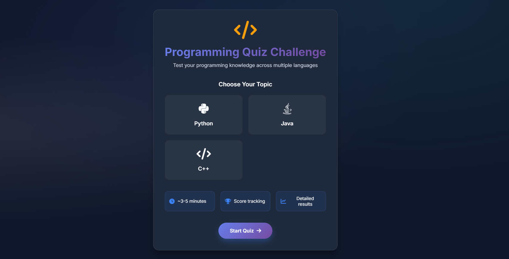
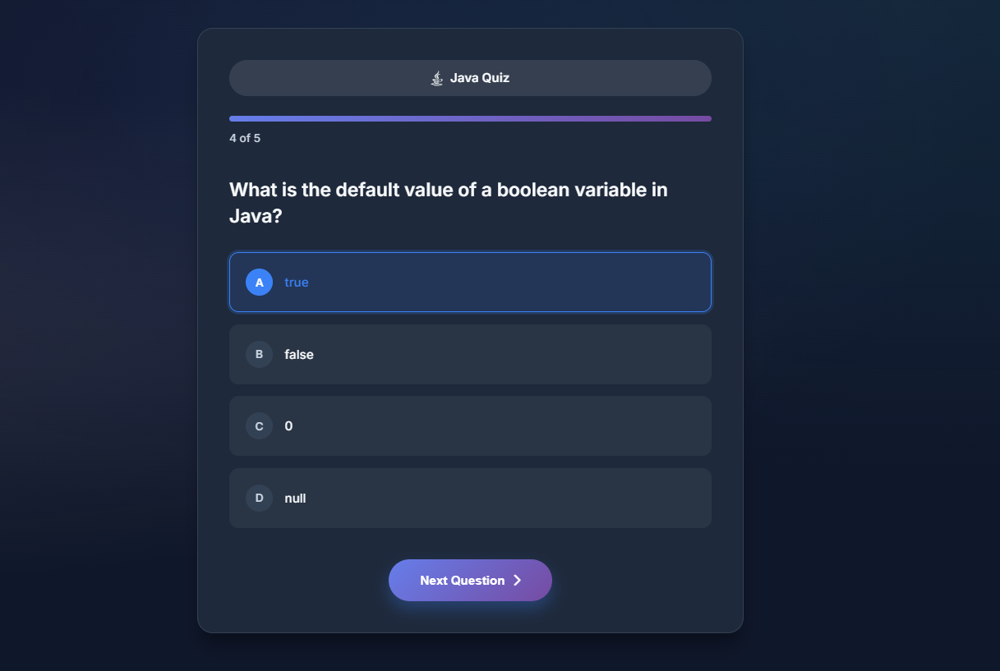
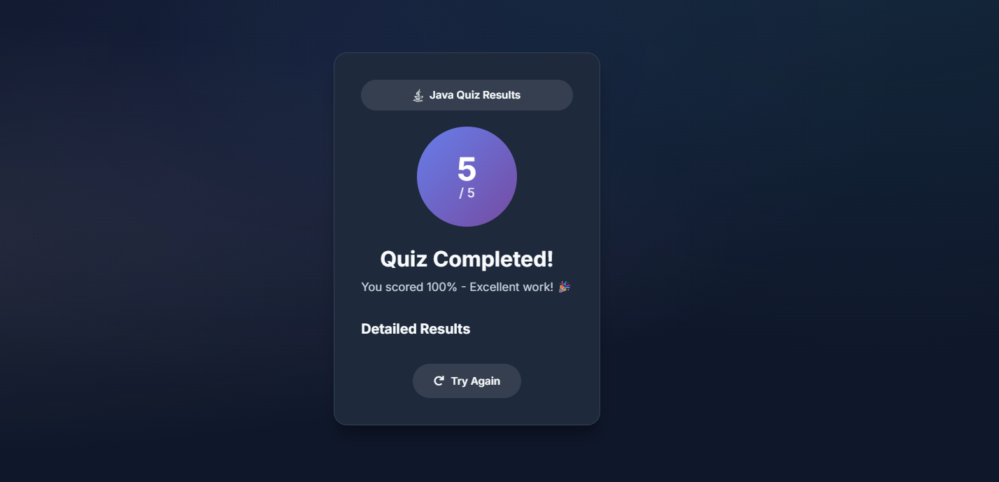

# 🧠 AI-Powered Programming Quiz App

[](https://www.python.org/)
[](https://flask.palletsprojects.com/)
[](https://www.langchain.com/)
[](https://huggingface.co/)

> An intelligent quiz application built with **Flask**, **LangChain**, and **Hugging Face** that automatically generates programming questions using Large Language Models (LLMs).

---

## 🚀 Overview

The **AI-Powered Programming Quiz App** is your interactive playground to test and improve programming knowledge.  
Instead of relying on static question banks, this app **dynamically generates** multiple-choice questions (MCQs) in real-time using **LLMs from Hugging Face** via LangChain.

**✨ Features:**
- 🔥 **AI-Generated Questions** – No two quizzes are ever the same!
- 🖥 Supports multiple programming languages (Python, Java, C++, etc.).
- 🧩 Multiple-choice format with instant answer checking.
- ⚡ Built with **Flask** for a lightweight, fast, and responsive backend.
- 🤖 Uses **LangChain** to connect with **Hugging Face** models.
- 🎨 Simple & clean UI for smooth user experience.

---

## 🖼️ Demo Screenshot








---

## 🛠️ Tech Stack

| Layer         | Technology |
|---------------|------------|
| Backend       | Flask (Python) |
| AI / LLM      | LangChain + Hugging Face Models |
| Frontend      | HTML5, CSS3, JavaScript (Jinja2 Templates) |
| Environment   | Python 3.10+ |

---

## 📦 Installation & Setup

### 1️⃣ Clone the Repository
```bash
git clone https://github.com/your-username/quiz-app-llm.git
cd quiz-app-llm
```

### 2️⃣ Create & Activate Virtual Environment
```bash
python -m venv env
# Windows
env\Scripts\activate
# Mac/Linux
source env/bin/activate
```

### 3️⃣ Install Dependencies
```bash
pip install -r requirements.txt
```

### 4️⃣ Setup Environment Variables
Create a `.env` file in the project root and add:
```env
HUGGINGFACEHUB_API_TOKEN=your_huggingface_api_key
```
You can get your API token from [Hugging Face](https://huggingface.co/settings/tokens).

### 5️⃣ Run the Application
```bash
python app.py
```
The app will be available at **http://127.0.0.1:5000**

---

## 📂 Project Structure
```
quiz-app-llm/
│
├── app.py                 # Flask application entry point
├── templates/             # HTML templates
│   ├── index.html
│   ├── quiz.html
│
├── static/                # CSS, JS, images
├── requirements.txt       # Python dependencies
├── .env                   # Environment variables
└── README.md              # Project documentation
```

---

## 🧠 How It Works

1. **User chooses a programming language** for the quiz.
2. Flask sends a prompt to **LangChain**, which communicates with the **Hugging Face** LLM.
3. The LLM generates **multiple-choice programming questions**.
4. Questions are displayed on the quiz page, and users can select their answers.
5. Instant evaluation and feedback are provided.

---

## 🌟 Future Enhancements
- 🏆 Leaderboard & scoring system
- 📊 Difficulty levels (Easy, Medium, Hard)
- 🎤 Voice-based quiz mode
- 🌐 Multi-language support

---

## 💡 Acknowledgements
- [Flask](https://flask.palletsprojects.com/)
- [LangChain](https://www.langchain.com/)
- [Hugging Face](https://huggingface.co/)
- All the amazing open-source contributors 🚀
